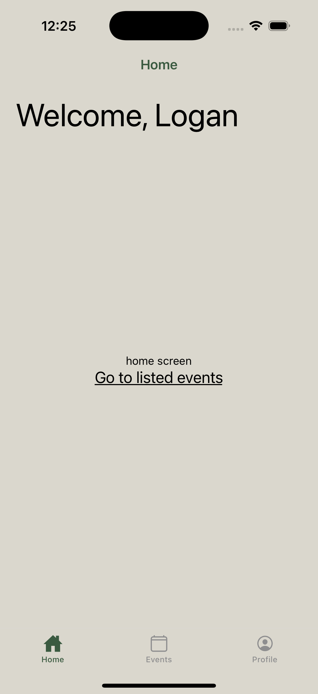
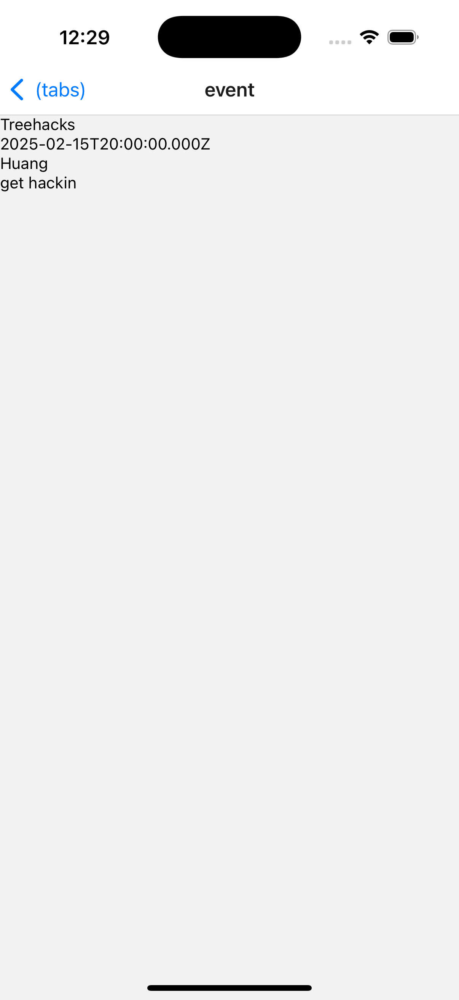

# CoVo Frontend

A cross-platform react-native app. Grabs data from the endpoints set up in covo-backend. One half of our TreeHacks 2025 project; mostly an excuse to learn react and Node.js.

## Images

Sign in with Google never got fully implemented because of frustration with documentation (and wanting to sleep).
